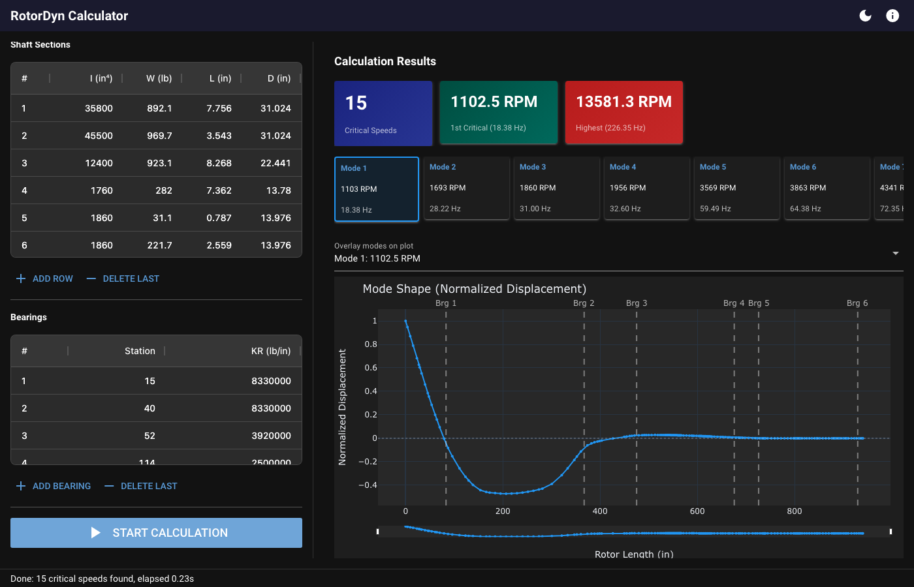

# RotorDyn Calculator

转子动力学横向振动计算工具，基于 **Myklestad-Prohl 传递矩阵法**。

提供现代化的浏览器 GUI 界面，支持交互式 Plotly 图表和可编辑数据表格。可通过 PyInstaller 打包为 Windows `.exe` 独立程序，无需安装 Python 环境。

> Rotor dynamics lateral vibration calculator using the Myklestad-Prohl transfer matrix method.



## 功能特性 / Features

- **文件导入**：拖拽或选择上传 `.rin` 输入文件，自动解析轴段、轴承参数
- **参数编辑**：通过 AG Grid 表格直接编辑轴段截面、轴承刚度、计算选项
- **临界转速分析**：计算临界转速、振型、广义质量、有效质量
- **交互式图表**：Plotly 振型图，标注轴承位置，支持悬停查看数据、多模态叠加显示
- **数据导出**：支持 Excel (.xlsx)、CSV、传统 `.rout` 格式导出
- **深色模式**：一键切换深色/浅色主题

## 快速开始 / Quick Start

### 环境要求

- Python 3.11+

### 安装并运行 GUI

```bash
git clone https://github.com/Jusfan99/rotordyn.git
cd rotordyn
pip install -e .
python main.py
```

启动后会自动打开浏览器，在 `http://127.0.0.1` 上运行 GUI 界面。

### 命令行模式（无 GUI）

```bash
python -m rotordyn input.rin
```

直接在终端输出计算结果和 ASCII 振型图。

## 使用流程

1. 启动程序 → 浏览器自动打开
2. 左侧面板上传 `.rin` 文件（或手动输入参数）
3. 点击 **Start Calculation** 开始计算
4. 右侧面板查看结果：模态卡片、振型图、详细数据表格
5. 点击 **Export Excel / CSV / rout** 导出结果

## 项目结构 / Project Structure

```
rotordyn/
├── rotordyn/
│   ├── config.py        # 常量定义（杨氏模量、重力加速度）
│   ├── models.py        # 数据模型（ShaftSection, Bearing, Rotor 等）
│   ├── parser.py        # .rin 文件解析器
│   ├── engine.py        # Myklestad-Prohl 求解器
│   ├── formatter.py     # 传统文本格式输出
│   ├── ascii_plot.py    # ASCII 振型图（命令行用）
│   └── gui/
│       ├── app.py       # NiceGUI 主应用 + 页面布局
│       ├── components.py # Plotly 图表、AG Grid 数据转换
│       └── export.py    # Excel/CSV/rout 导出功能
├── tests/               # pytest 测试套件（26 个测试）
├── main.py              # GUI 启动入口
└── pyproject.toml       # 项目配置 + 依赖
```

## 打包 Windows EXE

通过 GitHub Actions 自动构建 Windows 可执行程序，无需本地安装 Python。

**方式一**：打 tag 自动触发

```bash
git tag v0.1.0
git push origin v0.1.0
```

**方式二**：在 GitHub 仓库的 **Actions** 页面手动点击 **Run workflow**

构建完成后在 Actions 的 Artifacts 中下载 `RotorDyn-Windows.zip`，解压后双击 `RotorDyn.exe` 即可运行。

## 技术栈 / Tech Stack

| 组件 | 技术方案 | 说明 |
|------|---------|------|
| GUI 框架 | [NiceGUI](https://nicegui.io) | 基于 FastAPI + Vue.js + Quasar |
| 图表 | [Plotly](https://plotly.com/python/) | 交互式振型图 |
| 表格 | [AG Grid](https://www.ag-grid.com/) | 可编辑数据表格 |
| 求解器 | NumPy + SciPy | 传递矩阵法计算 |
| 打包 | PyInstaller | Windows exe 构建 |
| CI/CD | GitHub Actions | 自动化构建 |

## 测试 / Testing

```bash
pip install -e ".[dev]"
pytest
```

全部 26 个测试覆盖：文件解析、临界转速计算、振型验证。

## License

MIT
